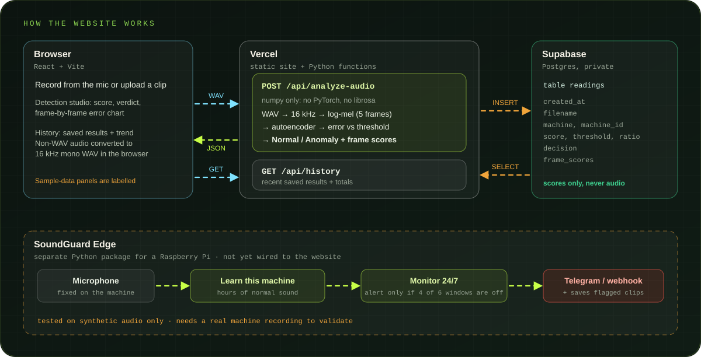

<p align="center">
  
</p>

<p align="center">
  
  
  
  
  
  
</p>

<p align="center">
  <b>Put a microphone on a machine. Learn what "normal" sounds like. Get told when it stops sounding normal.</b><br>
  Acoustic anomaly detection built for small and medium manufacturers, with textile workshops in mind.
</p>

<p align="center">
  <a href="https://sound-guard-rust.vercel.app"><b>Live demo</b></a> ·
  <a href="#results">Results</a> ·
  <a href="#how-it-works">How it works</a> ·
  <a href="#honest-limits">Honest limits</a> ·
  <a href="#deploy-your-own">Deploy your own</a> ·
  <a href="#contact">Contact</a>
</p>

<p align="center">
  <a href="https://sound-guard-rust.vercel.app"></a>
  <a href="https://www.linkedin.com/in/venkata-sriharika-prathipati-b9491b300"></a>
  <a href="mailto:sriharikaprathipati@gmail.com"></a>
  <a href="https://github.com/venkatasriharika-code"></a>
</p>

---

## Why this exists

A loom, a spinning frame or a pump rarely fails without warning: the **sound changes first**. A worn bearing whines, a belt slaps, a needle starts to skip. Condition-monitoring systems that catch this exist, but they are priced for large plants.

SoundGuard takes the cheapest possible approach: one microphone, one small computer, and a model that learns **only from healthy sound**. Fault recordings are rare and expensive to collect, so the model never needs them. It learns what normal looks like and flags whatever falls outside it.

> [!IMPORTANT]
> **What is real and what is not.** The live model is trained on the public **DCASE 2020 Task 2** benchmark (fans, pumps, valves, slide rails, toy cars and conveyors). It has **never heard a textile machine**, and only one model (`pump_id_04`) is calibrated to give a Normal/Anomaly verdict. Several dashboard pages are an illustrative prototype and are labelled **SAMPLE DATA** in the app. See [Honest limits](#honest-limits).

## Results

23 autoencoders were trained, one per machine ID, each on normal sound only. Scores are AUC and pAUC (the DCASE metrics) on the official test split.

| Machine type | Mean AUC |
|---|---|
| Slide rail | 82.06 % |
| Toy car | 81.70 % |
| Pump | 76.02 % |
| Toy conveyor | 70.77 % |
| Fan | 68.89 % |
| Valve | 66.35 % |
| **All 23 machine IDs** | **74.45 % AUC · 60.89 % pAUC** |

The best single model, **`pump_id_04`**, is the one the live site uses:

| Check | AUC | Faults caught | False alarms on normal |
|---|---|---|---|
| Training notebook (official test split) | **0.973** | – | – |
| Deployed site, first 50 normal + 50 anomalous files | **0.975** | 98 % | 14 % |
| Deployed site, next 50 normal + 50 anomalous files | **0.976** | 98 % | 14 % |

Read these honestly:

- The deployed site reproduces the notebook's result, so the website really runs the trained model.
- **97 % is the best machine, not the typical one.** The average over all 23 is about 74 %.
- 14 % false alarms is **7 of 50 normal files** (roughly 7 to 26 % with that few samples), too high for a factory to trust on its own. The threshold was also chosen on data of the same kind it is reported on, so treat recall and false alarms as optimistic. AUC does not depend on the threshold, so it is the figure to quote.

## How it works

<p align="center">
  
</p>

1. **Features.** Audio is resampled to 16 kHz and turned into a log-mel spectrogram (1024-point FFT, hop 512, 64 mel bands). Five consecutive frames are stacked into one 320-value vector.
2. **Model.** A fully connected autoencoder: `320 → 128 ×4 → 8 → 128 ×4 → 320`, with batch norm and ReLU. Trained to rebuild **normal** sound.
3. **Score.** The mean squared reconstruction error across the clip. Normal sound is rebuilt well (low error); anything the model has never seen is rebuilt badly (high error).
4. **Verdict.** The score is compared with a threshold set from normal files. `ratio = score / threshold`; above 1.0 is flagged.

### Why the inference code looks unusual

Vercel functions are limited to about 250 MB, which rules out PyTorch and librosa. So the 23 checkpoints were converted to small `.npz` files (batch norm folded into the linear layers) and the feature extraction was rewritten in plain numpy. Both were checked against the originals:

| Piece | Checked against | Result |
|---|---|---|
| Mel filterbank | `librosa.filters.mel` | max relative error ≈ 1e-7 |
| Log-mel features | `librosa.feature.melspectrogram` | max difference ≈ 3e-6 dB |
| Network outputs, all 23 models | the notebook's PyTorch `AutoEncoder` | max relative difference ≈ 3e-6 |
| End to end on the deployed site | the notebook's AUC | 0.975 vs 0.973 |

## Features

- **Detection studio.** Upload a clip or record from the microphone. The browser converts MP3, OGG, FLAC and WebM recordings to 16 kHz mono WAV before sending. You get the score, the threshold, the ratio, the verdict and a frame-by-frame error chart.
- **History.** Every analysis is saved (score and metadata only, **never the audio**) and shown as a table and a trend against the threshold.
- **Model Lab.** The real per-machine AUC and pAUC table for all 23 models.
- **Edge monitor.** A separate package that learns one machine's own sound on a Raspberry Pi and alerts the owner. See [SoundGuard Edge](#soundguard-edge).

## Use the API

```bash
curl -X POST "https://sound-guard-rust.vercel.app/api/analyze-audio?machine=pump&machineId=04&filename=clip.wav" \
     -H "Content-Type: audio/wav" --data-binary @clip.wav
```

Abridged response:

```json
{
  "decision": "Anomaly",
  "score": 2.215,
  "threshold": 0.5359,
  "scoreThresholdRatio": 4.13,
  "calibrated": true,
  "frameScores": [ ... ],
  "saved": true
}
```

Limits: uncompressed PCM WAV, up to about 4 MB and 60 seconds per request. Machine IDs other than `pump` / `04` return a score with the verdict `Uncalibrated`. `GET /api/history?limit=100` returns recent saved results.

> A recording of anything other than that one benchmark pump will read as an anomaly. The model only knows what *that pump* sounds like when healthy.

## Deploy your own

**1. Database (optional, for History).** Create a free [Supabase](https://supabase.com) project, open the SQL editor and run [`supabase_schema.sql`](supabase_schema.sql). Row-level security is on, so only the server key can read or write.

**2. Vercel.** Import this repository. `vercel.json` already configures the static build and the Python functions. Add two environment variables (`Secret` for the key):

| Variable | Value |
|---|---|
| `SUPABASE_URL` | your project URL, e.g. `https://abcd1234.supabase.co` |
| `SUPABASE_SERVICE_KEY` | the **secret** key (`sb_secret_…` or legacy `service_role`). Never the publishable key, never in the browser |

Without these two, analysis still works. Results just are not saved.

**3. Check it reproduces the benchmark.** With the DCASE pump test files on your machine:

```bash
pip install requests scikit-learn
python evaluate.py --url https://sound-guard-rust.vercel.app --dir <path>/pump/test --machine pump --id 04 --limit 50
```

You should see an AUC close to 0.97.

## SoundGuard Edge

The part that matches the original idea: a microphone on a machine, listening 24/7, on a Raspberry Pi or any computer, with no audio leaving the device. It lives in [`edge/`](edge/).

- **Learns each machine on site** from a few hours of its own normal sound; the last 30 % is held out to set the threshold honestly.
- **Two detectors in one.** A frame-level one catches new tones (a whining bearing). A 2-second-context one catches rhythm changes (a skipped beat), which the frame-level model alone missed entirely in testing.
- **No false alarms from one-off noises.** An alert needs 4 of the last 6 windows to be abnormal, then a cooldown, then a "back to normal" message.
- **Alerts** by Telegram or webhook; **flagged clips are saved** so they can be sorted by cause into a real fault dataset over time.
- Optional PyTorch trainer for the same autoencoder, on your own recordings.

```bash
cd edge && pip install -r requirements.txt
python -m soundguard_edge selftest                      # sanity check, ~10 s
python -m soundguard_edge learn   --config config.json --minutes 180 --out baseline.npz
python -m soundguard_edge monitor --config config.json --baseline baseline.npz
```

> Tested on **synthetic** audio only. It works as designed, but real accuracy is unknown until it hears a real machine.

## Honest limits

- **One calibrated model.** Only `pump_id_04` gives a verdict. The 23-model average AUC is about 74 %.
- **False alarms are still high** (about 14 % on normal pump clips) at the chosen threshold.
- **Benchmark sounds only.** A microphone recording of your own machine, or anything else, will be flagged as an anomaly by the pump model.
- **Sample-data panels.** The plant overview, live monitoring and maintenance pages are an illustrative prototype (labelled in the app). Real results live in Detection studio and History.

## Roadmap

- [ ] Record a real machine (even one sewing machine) and run the edge monitor on it
- [ ] Try public sewing-machine recordings as a first textile-adjacent benchmark
- [ ] Calibrate more machine IDs and lower the false-alarm rate
- [ ] Send edge-monitor readings to the website's History
- [ ] Watchdog alert when the monitor itself goes offline
- [ ] Per-visitor history and sign-in
- [ ] Add a vibration sensor (cheap accelerometer) for noisy workshops
- [ ] Fault-type classification once labelled clips accumulate

## Repository layout

```
api/                       Python serverless functions (numpy only)
  analyze-audio.py           POST: score a WAV, save the reading
  history.py                 GET: recent saved results
  _core.py                   WAV decoding, resampling, log-mel, autoencoder
  _db.py                     tiny Supabase REST client
  _models/                   23 converted models + calibration + results.csv
client/                    React + Vite app
notebooks/                 Kaggle training notebook (DCASE 2020 Task 2, 23 models)
edge/                      SoundGuard Edge (Raspberry Pi monitor)
python_service/            calibration and threshold-study records
docs/                      the animated SVGs above
supabase_schema.sql        table + row-level security
evaluate.py                reproduce the benchmark against a deployment
vercel.json                build + function configuration
```

## Data and references

Models are trained on **DCASE 2020 Challenge Task 2**, which is built from two datasets:

- Purohit et al., *MIMII Dataset: Sound Dataset for Malfunctioning Industrial Machines Investigation and Inspection*, DCASE 2019 Workshop.
- Koizumi et al., *ToyADMOS: A Dataset of Miniature-Machine Operating Sounds for Anomalous Sound Detection*, WASPAA 2019.
- Koizumi et al., *Description and Discussion on DCASE2020 Challenge Task 2: Unsupervised Anomalous Sound Detection for Machine Condition Monitoring*, 2020.

Check each dataset's license before any commercial use (MIMII is released under CC BY-SA 4.0).

## Contact

Built by **Venkata Sriharika Prathipati**. If you work with textile or small-scale manufacturing and would let a microphone listen to a machine for a few hours, or you want to talk about the project, I would love to hear from you.

| | |
|---|---|
| **Live demo** | [sound-guard-rust.vercel.app](https://sound-guard-rust.vercel.app) |
| **LinkedIn** | [venkata-sriharika-prathipati](https://www.linkedin.com/in/venkata-sriharika-prathipati-b9491b300) |
| **Email** | [sriharikaprathipati@gmail.com](mailto:sriharikaprathipati@gmail.com) |
| **GitHub** | [@venkatasriharika-code](https://github.com/venkatasriharika-code) |

---

<p align="center">acoustic anomaly detection for the machines that keep small factories running.</p>
